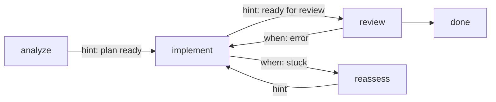

# Multi-stage workflows

Asking one model, with one prompt and one set of tools, to plan a change and write it and review it
usually goes badly. The tools that help it write are a distraction while it is planning, and by
review time its context is full of the work it is supposed to be judging.

So a Leviath blueprint is split into **stages**. Each stage is one job, with its own model, its own
tools, and its own context. When a stage is done, an edge decides which stage runs next.

## Graph

Here is a small workflow with all four kinds of arrow in it:


```mermaid
flowchart LR
  analyze -->|hint: plan ready| implement
  implement -->|hint: ready for review| review
  implement -->|when: stuck| reassess
  review -->|when: error| implement
  reassess -->|hint| implement
  review --> done["done"]
```

And the edges that produce it. Stages are `[[graph.stages]]` entries in the blueprint's
`agent.toml`, and each edge is a `[[graph.edges]]` entry naming the stage it leaves (`from`) and the
stage it enters (`to`). This is the whole shape, so you can see how the pieces fit before meeting
them one at a time:

```toml
[[graph.edges]]
name = "implement"
from = "analyze"
to = "implement"
hint = "The plan is ready"

[[graph.edges]]
name = "review"
from = "implement"
to = "review"
hint = "Implementation complete, ready for review"

[[graph.edges]]
name = "reassess"
from = "implement"
to = "reassess"
when = "stuck"
stuck = { after_iterations = 20 }

[[graph.edges]]
name = "implement"
from = "review"
to = "implement"
when = "error"

[[graph.edges]]
name = "implement"
from = "reassess"
to = "implement"
hint = "Replanned, try again"
```

An edge's `name` must be unique among the edges leaving its stage. Naming it after the stage it
enters, as here, is the convention. The run starts in the first stage listed, or in the one
`[graph] entry` names.

Check any graph before you run it:

```bash
lev validate .             # checks the graph is well formed
```

### A run has to be able to end

A run ends in a stage that no normal edge leaves, or in one with `allow_complete = true`. A graph
in which the run can reach a stage and never get from there to such an end may loop for ever. So
can a stage with an edge back to itself and no `max_revisits`.

That graph is still allowed to run, because a loop is sometimes what you meant. It is never
quiet about it. `lev validate` prints a banner at the top of its report naming the stages that
cannot reach an end, and so does `lev run --check`. A spawn answers with the same list as
`warnings` beside the new run's id, on the CLI, REST, GraphQL, ACP and the `spawn_agent` tool. The
first lines of the run's log say it, `lev ps` marks the run `(may never finish)` and lists why
under the table, and `lev run show` repeats it. Stop such a run with `lev cancel <run>`.

`lev validate --deny-warnings` fails on these, for a build that should never ship a loop.

## Transitions

Every edge is one of two kinds:

- A **normal** edge is taken when the stage finishes. If the stage has several, the agent picks the
  one whose `hint` best matches what it just did.
- A **conditional** edge fires on its own, on a signal from the runtime rather than the agent's
  choice. Its `when` names the signal: `error`, `stuck`, `max_iterations` (the stage hit its
  iteration cap), or `dead_end` (the graph would otherwise strand here).

```toml
[[graph.edges]]
name = "review"
from = "implement"
to = "review"
hint = "Implementation complete, ready for review"

[[graph.edges]]
name = "reassess"
from = "implement"
to = "reassess"
when = "stuck"               # a runtime signal, not the agent's choice
```

`error` fires when a stage cannot go on. A provider refused the request, or the model's replies were
cut off in the middle of a tool call four times in a row (see
[stages and models](/docs/agents#stages-and-models)). The recovery stage finds the
reason in the context. With no `error` edge the run fails.

The full set of `when` values is `always` (the default), `llm_choice`, `error`, `max_iterations`,
`stuck`, and `dead_end`. `always` and `llm_choice` both mark a normal edge. A stage that no edge
leaves ends the run. Anything else in `when` is a parse error rather than an edge that quietly does nothing, so a
typo fails at `lev validate` instead of at 2am.

### The escape that is not also a shortcut

`when = "dead_end"` fires in one situation: the stage finished, and every normal edge's target
has spent its `max_revisits`. Without it the run errors out, and everything it established is
discarded: a profiled dataset, a plan, two rounds of critique.

```toml
[[graph.edges]]
name = "review"
from = "plan"
to = "review"
hint = "Plan is ready for review"

# Taken only when `review` is out of revisits and there is nowhere legal to go.
[[graph.edges]]
name = "answer"
from = "plan"
to = "answer"
when = "dead_end"
```

Why is this its own `when`, rather than "add an ordinary edge to the output stage"? An ordinary
edge is offered to the model at the end of **every** visit, so it becomes a shortcut past
the rest of the pipeline. Measured on four agents, that shortcut was taken in 10 of 24 runs of one
and 21 of 36 of another, computing nothing on the way. A `dead_end` edge is invisible to the model's
choice and reachable only when the alternative is dying.

`error` edges are also consulted on this path, so a stage that already has one is covered. When both
are declared, `dead_end` wins: an `error` edge is carrying provider failures too and may want to go
somewhere else.

> [!NOTE]
> `when = "max_iterations"` does **not** cover this. It fires when a stage burns its iteration
> budget, which is a different event. On the stranding path it is never consulted. `lev validate`
> reflects that: a `max_iterations` edge does not silence `dead-end-possible`.

### Stage keys that shape routing

| Key | Default | Effect |
|---|---|---|
| `max_revisits` | unlimited | How many times this stage may be re-entered, not counting the first visit. See below |
| `transition_prompt` | built-in | Replaces the prompt used to ask the model which edge to take |
| `allow_complete` | `false` | Offers the model an explicit `DONE` answer that ends the run. See below |
| `requires_children` | `false` | Holds the stage until every sub-agent it spawned has finished |
| `allow_as_worker` | `false` | Lets this stage be the target of a [fan-out](/docs/sub-agents) |
| `accepts_messages` | `true` | Whether `lev msg` reaches this stage. See [Human-in-the-loop](/docs/interaction) |
| `allow_blocking_tools` | `false` | Marks an autonomous stage as deliberately offering the tools that wait on a person |
| `input_accepts` | the visible regions' `accepts` | The mime types the stage takes as [parts](/docs/mime). See below |
| `input_as_text` | `[]` | Mime types whose parts reach this stage's model as text whatever the model takes |
| `output.artifacts` | `[]` | The files the stage hands back beside its answer, by name and type. See [Final outputs](/docs/outputs#large-results) |
| `output.overwrite_artifacts` | `[mime]` setting, off | Whether an artifact may replace a different file already at its path. See [Final outputs](/docs/outputs#large-results) |
| `output_routing` | `{}` | Where the model's produced parts go, by mime type: `"image/*" = "artwork"`. See [Routing produced parts](/docs/context#routing-produced-parts) |
| `reset` | `[]` | Regions emptied when the stage is entered, for a clean slate. See [A clean slate for the next stage](/docs/context#a-clean-slate-for-the-next-stage) |
| `tool_accepts` | `{}` | What each tool may be handed at this stage, as `tool = ["image/*"]`. See [Mime](/docs/mime#what-a-tool-may-be-handed) |

Some of those need a sentence more.

`max_revisits` is also read when the runtime builds the list of edges to offer. An edge pointing at
a stage that is out of budget is dropped from the choices.

`allow_complete` adds `DONE` to the answers the model may give, and that answer ends the run.
Without it the model has to take one of the stage's outgoing edges, even when only one is on offer.

`allow_as_worker` is off by default so that you can only fan out into a stage that was designed for
it, rather than into any stage that happens to look suitable.

`allow_blocking_tools` grants nothing and changes no behaviour. An autonomous stage that calls a
human-in-the-loop tool waits until somebody answers, and on an unattended run that is forever, which
is why `lev validate` warns about it. Setting this key tells the linter you meant it, so it stops
reporting a deliberate choice as an oversight. Use it when the stage is driven from the dashboard,
or by somebody watching.

`input_accepts` is read in two places. It prefers a model that can see those types, and
`lev validate` reads it as well.

`output.overwrite_artifacts` decides what happens when a produced part handed back as an artifact
lands on a path some other file already holds. Off, the part is written beside that file, under a
name carrying its hash.

`tool_accepts` fences each tool separately. A stored part outside a tool's list is out of that
tool's reach at this stage.

### Every stage should name its own model

`model` is per stage, written as a list of models best first:
`model = { models = [{ provider = "anthropic", model = "claude-sonnet-5" }] }`. There is no
blueprint-wide model. A `model` key under `[graph]` is refused as an unknown key.

A stage that omits `model` does not fail. It runs on whichever provider your `[providers]`
config makes the default. That is rarely what the author intended, and you will not find out until
the run picks the wrong model. `lev validate` reports it.

### Carrying context across an edge

Each edge decides what the next stage inherits, using `carry`:

```toml
[[graph.edges]]
name = "review"
from = "implement"
to = "review"
hint = "Ready for review"
carry = { compact = {} }     # "direct" | "clear" | { compact = {} } | { custom = { ... } }
```

- `"direct"` is the default and carries everything as-is.
- `"clear"` drops stage-specific regions and keeps pinned ones.
- `{ compact = {} }` sends the stage's content through a summarization pass before the next stage
  starts. `{ compact = { prompt = "..." } }` replaces the summarizing prompt. **It summarizes every region that is not pinned**, not only the
  transcript. That includes the ones holding your results. A region whose content does not survive a
  rewrite should say so:

  ```toml
  [[graph.layout.regions]]
  name = "results"
  kind = { kind = "sliding_window", max_items = 20 }
  budget = "20%"
  summarizable = false
  ```

  That protects it wherever it is used, rather than at each edge that might touch it.
  `summarizable = false` also wins over an explicit `compact` list. `lev validate` warns when a bare
  `compact` edge would summarize a region declared `required`, which is the closest thing a
  blueprint has to "this is a deliverable".
- `custom` names regions one at a time:

```toml
[[graph.edges]]
name = "review"
from = "implement"
to = "review"

[graph.edges.carry.custom]
carry          = ["plan", "codebase"]    # pass through untouched
compact        = ["conversation"]        # summarize into the next stage
clear          = ["scratch"]             # drop entirely
compact_prompt = "Summarize what changed and why"
```

A region declared `pinned` is never touched by an edge's `carry`. That is why the error and stuck
reports described below are worth pinning: you want them to survive the edge that carries them.

### Gating an edge on actual work

A stage that was meant to change files can announce it is finished without having changed any. An
edge `gate` refuses the transition until the stage has something to show:

```toml
[[graph.edges]]
name = "review"
from = "implement"
to = "review"
hint = "Implementation complete, ready for review"
gate = { require_modifications = true, max_attempts = 3 }
```

| Field | Default | Meaning |
|---|---|---|
| `require_modifications` | `false` | Require at least one successful file-modifying tool call in the stage being left |
| `require_regions` | `[]` | Regions that must **all** hold content. ANDed with every other condition here |
| `require_region_updated` | unset | Require that a named region **changed** during this stage, rather than only holding content. See below |
| `require_no_open_items` | unset | Name a [checklist region](/docs/context) that must have no open items before this edge is taken |
| `require_region_entries` | unset | `{ region = "views", at_least = 4 }`: the region must hold that many entries or more. See below |
| `message` | generated | The nudge shown when the gate blocks |
| `region` | unset | An **alternative** way to satisfy `require_modifications`: the gate also passes if this region is non-empty. See below |
| `tools` | `[]` | Extra tool names to count as modifying, beyond `write_file` and `edit_file` |

A `require_modifications` gate on a stage that has no tool able to change a file is refused when
the graph is checked. It could never be met: grant the stage `write_file` or `edit_file`, name the
tool that writes in the gate's `tools`, or drop the requirement.

`require_region_entries` re-runs the stage with the gate's message until the count is met. That is
how a stage whose model cannot call tools keeps going until its set is complete. An image model
returns however many pictures it likes per reply, and the gate asks again until there are enough.

### `region` is an alternative, `require_regions` is a requirement

These two read alike and do opposite things.

`region` is one of several ways to satisfy `require_modifications`, alongside "a file was modified"
and "a modification was denied by policy". It exists because per-stage counters do not survive a
daemon restart and a region does, so it is the durable stand-in. It is an **or**:

```toml
# Passes as soon as the stage writes any file, even with `plan` still empty.
gate = { require_modifications = true, region = "plan" }
```

`require_regions` is the conjunction. Every region named must hold content, whatever else the gate
is satisfied by:

```toml
# Does not leave until `plan` has been written, full stop.
gate = { require_regions = ["plan"] }

# And this one wants both: files changed AND the plan written.
gate = { require_modifications = true, require_regions = ["plan"] }
```

Like every gate it shares the one `max_attempts` budget, so it re-runs the stage a bounded number of
times and then lets the edge through with a warning rather than stranding the run. When that
happens the run records it in its state: `flags.gates_forced` counts the transitions that went
through unsatisfied, and `flags.required_regions_abandoned` names any `required = true` region a
stage gave up on. A run that produced its artifact and one that was asked twice and moved on both
finish `complete`, and those two fields are how you tell them apart. [Inspecting a
run](/docs/inspecting-a-run) shows where to read them.

### Requiring a revision, not a repetition

Every other gate asks whether something *exists*, which a stage sent back to redo its work can
satisfy by re-emitting what it already wrote. On a `review -> plan` back-edge that means a
reviewer's rejection can be answered with the same plan, and the loop spins until the stage runs
out of revisits.

```toml
[[graph.edges]]
name = "compute"
from = "plan"
to = "compute"
gate = { require_region_updated = "plan", message = "The check rejected this plan. Change it before computing again." }
```

The region's content is hashed when the stage is entered and compared when it tries to leave, so
"changed" means changed by *this* pass. It shares the same `max_attempts` budget as every other
gate: a gate that could hold a stage forever would strand the run, so after the budget the edge is
taken with a warning. A gate naming a region no stage declares is refused by `lev validate`. At runtime such a gate
would pass rather than block, since no amount of work could satisfy it. A typo there would read as
a gate that is never reached.
| `max_attempts` | `3` | How many times the stage re-runs before the gate gives up and lets the transition through with a warning |

Per-stage tool counters reset when a stage is entered, and they are not restored when a run resumes
after a daemon restart. Context regions are. So pointing `region` at whatever your write tools are
routed into keeps a resumed run honest.

Set `tools` when an agent's writes go through MCP or [script tools](/docs/rhai-tools) instead of the
built-ins.

### What counts as output

Four things count as an agent having produced something. A successful `write_file`, a successful
`edit_file`, a successful call to a tool you named in a gate's `tools` list, or a submitted
[final output](/docs/outputs).

Nothing else counts, and `shell` in particular does not. An agent can edit a file with `sed -i`, and
Leviath has no way to see that it happened.

Both an edge gate and the run's own `empty_output` verdict use that same rule. They differ only in
scope: the gate asks about one stage, the verdict asks about the whole run.

The verdict is only ever applied to agents that could plausibly write files. If no stage of a
blueprint advertises a file-modifying tool, the run is never marked as having produced nothing. A
router that delegates and a researcher whose answer is its text have no file changes to be missing,
so flagging them would be wrong. Such an agent can also settle the question outright by submitting a
[final output](/docs/outputs). The side effect is that an agent writing through MCP looks the same
way, so name that tool in a gate's `tools` list to have it counted.

`lev ps` marks such a run `complete (no output)`, and the flag travels with it into the run's
state, the completion webhook, and the `leviath.runs.total` metric.

## Stuck detection

A `stuck` edge gets a stage out of a loop it is not going to escape on its own. The important part
is that stuckness is **measured, not self-reported**. An agent cannot keep insisting it is nearly
done:

```toml
[[graph.edges]]
name = "reassess"
from = "implement"
to = "reassess"
when = "stuck"

[graph.edges.stuck]
after_iterations      = 20   # inferences in this stage
after_same_file_edits = 5    # write/edit calls against one path
after_tool_calls      = 100
after_minutes         = 30
```

Use any subset you like. The first threshold to trip fires the edge.

> [!TIP]
> When a `stuck` or `error` edge fires, the runtime writes *why* into the target stage's
> [context](/docs/context), so the recovery stage starts out knowing what went wrong instead of
> working it out again. The same happens when a stage hits its iteration cap: whatever runs next is
> told the work was cut off rather than finished.
>
> Stuck reasons go to a `stuck_report` region when the blueprint declares one. Error and
> iteration-cap notes prefer an `error_report` region. Declare both `pinned`, with a small budget
> like 2000 tokens, so the note survives the edge `carry` that moves it. Without them, the
> notes land in `conversation`.

## Nudging

When a stage's model replies with plain text before making a single tool call, the runtime normally
adds a `[System]` nudge saying "You have tools available" and re-runs the stage, up to three times.

That is the right reflex for a coding stage that has stalled. It is the wrong one for a stage whose
deliverable *is* text. A planner told to use its tools goes looking for a write tool it was never
given.

So each stage can say what should happen instead:

```toml
[graph.nudge]                # the default for every stage
max = 2

[[graph.stages]]
name = "plan"
nudge = { enabled = false }  # this stage's deliverable is text, never nudge it

[[graph.stages]]
name = "implement"
nudge = { max = 2, text = "You have edit tools. Make the change described in {regions} rather than describing it again." }
```

All three keys are optional and cascade independently. A stage's `nudge` beats `[graph.nudge]`,
which beats the `[nudge]` section of your `config.toml`, which falls back to the built-in defaults.

This is a usability setting, not a permission, so a blueprint may raise `max` above your global
setting as freely as it lowers it.

The `text` can use `{stage}` for the stage's name and `{regions}` for the comma-separated names of
the stage's required context regions. The same substitution works in a required region's
`required_message`, where `{region}` names the region being asked for.

One stage shape is already exempt with nothing configured: a stage with interaction points presents
its text for review, so it is never nudged for producing exactly that text. Setting `enabled`
explicitly at any level overrides this in either direction.
