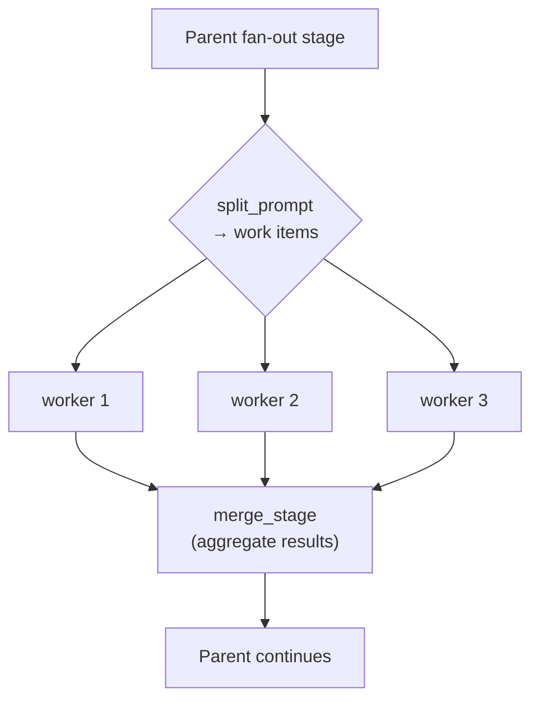
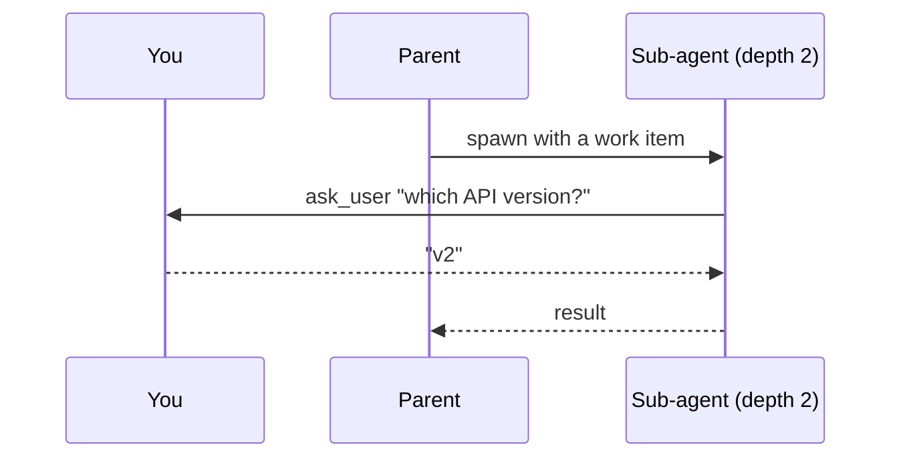

# Sub-agents and fan-out

Some jobs are really many small jobs. Twelve failing tests, forty files to review, eight sub-topics
to research. One agent working through them in sequence is slow, and by item nine its context is
full of items one through eight.

A **sub-agent** is a child agent started by another one. Give each item its own sub-agent and they
run at the same time, each with a clean context, and the parent gets the results back.

Five bundled agents work this way: `data-analyst` gathers one slice of a subject per worker,
`reviewer` takes a file or hunk group each, `log-analyzer` a log file or time window, and
`deep-researcher` and `wide-researcher` hand each sub-question to a whole `researcher` run. See the
[agent catalog](/docs/agent-catalog) for all five.

Sub-agents cost very little here. They are more entities in the same [world](/docs/engine), so there
are no extra processes to start and nothing has to be serialized between a parent and its children.

## Fan-out

A fan-out stage splits a task into work items, runs one sub-agent per item (up to `max_workers` at a
time), and merges the results back into the parent:



```toml
[stages.fix]
mode         = "fan_out"
worker_stage = "fix_one"    # which worker to run, see below
split_prompt = "..."        # prompt that produces the JSON array of work items
merge_stage  = "verify"     # stage the parent resumes at once workers finish
max_workers  = 8            # how many run at once, default 30; 0 is unlimited
on_worker_failure = "continue"
```

Those keys sit directly on the stage next to `mode = "fan_out"`, not in a sub-table.

| Key | Default | Meaning |
|---|---|---|
| `worker_agent` | unset | A separate installed blueprint to run as the worker |
| `worker_stage` | unset | A stage in *this* blueprint, which must set `allow_as_worker = true` |
| `worker_query` | unset | A hint matched against installed agent types |
| `merge_stage` | unset | Stage that reconciles worker results before the parent moves on |
| `results_region` | `conversation` | Where the consolidated worker report lands |
| `max_items` | unset | Most work items the split may produce. `0` or unset means however many it produces |
| `max_workers` | `30` | How many workers run at once. `0` means unlimited |
| `on_worker_failure` | `"continue"` | `continue` merges what succeeded. `fail_all` fails the whole fan-out if any worker fails |
| `split_prompt` | `""` | Added to the stage's system prompt. It asks for the work items; see below |

Set exactly one of `worker_agent`, `worker_stage`, or `worker_query`. `lev validate` checks that,
and checks that a named `worker_stage` exists and has opted in with `allow_as_worker`.

### How the split answers

The stage's single inference is the split. It carries `split_prompt` in its system prompt, and it
is offered one tool, `submit_work_items`, which every fan-out stage gets whether or not it lists
any `available_tools`:

```json
{"items": [
  {"id": "half-life", "context": {"question": "How long does semaglutide stay active?"}},
  {"id": "after-stopping", "context": {"question": "What happens when someone stops?"}}
]}
```

Each item's `context` is everything its worker gets. A worker is a separate agent with a clean
context window and never sees the parent's conversation, so a reference to "the topic above"
reaches nobody.

A model that ignores the tool and replies in text is still understood. The reply is read as JSON,
and an `{"items": [...]}` envelope, a single bare object, or a plain array of question strings are
all accepted. A reply that cannot be read at all is handed back with a correction and asked again,
twice, before the stage gives up.

**An empty list is a real answer.** `submit_work_items` with `items: []` means there is nothing to
hand out, and the run moves on to `merge_stage`. That matters most on a stage a run enters more
than once: the second time through, the honest answer is often that the work is already done, and
without a way to say it the split answers in prose instead. A re-entered fan-out stage is told
which round it is on and what the previous round already covered.

### When a split cannot be used

A split that is still unusable after its corrections never ends the run. It takes, in order:

1. the stage's `error` transition, if it declares one;
2. its `dead_end` transition, if it declares one;
3. failing both, an empty fan-out into `merge_stage`, with the reason written into `error_report`
   and counted in the run's `splits_degraded` flag.

The third is a degradation - the workers never ran, and whatever comes next works from less than
the blueprint intended - so `lev validate` warns (`fanout-no-escape`) about a fan-out stage that
declares neither escape.

```toml
[stages.investigate.transitions.error_recovery]
condition = "error"
```

### A worker that is a whole other agent

`worker_stage` keeps the work inside this blueprint. `worker_agent` hands each item to a separate
installed agent instead, which is worth doing when one already does the job:

```toml
[stages.investigate]
mode = "fan_out"
worker_agent = "researcher"    # every item is a full researcher run
merge_stage = "analyze"
max_workers = 30
```

That is what the bundled `deep-researcher` and `wide-researcher` do. The difference is not only who
does the work: a `worker_agent` worker is a run of its own, so it brings its own stages, its own
tools, and its own clean context window, rather than a share of the parent's.

The cost is a dependency. The named blueprint has to be installed, and `lev validate` cannot check
that for you the way it checks a `worker_stage`, because what is installed is a property of the
machine rather than of the blueprint. A missing one fails per item, so with the default
`on_worker_failure = "continue"` the run reports it rather than dying. `lev setup` installs the
bundled agents together, so this only bites when an agent has been installed on its own.

## What a worker hands back

A worker contributes whatever it submitted through
[`submit_output`](/docs/outputs). That submission is what the merge stage reads.

A worker that submits nothing falls back to the text of its last message. That text is often empty,
because a worker whose final action was a tool call has no trailing prose. Set `require_output` on
the worker stage when the merge depends on its answer.

```toml
[stages.fix_worker]
mode = "autonomous"
available_tools = ["read_file", "edit_file", "shell", "submit_output"]
allow_as_worker = true
require_output = true
```

A worker that finishes without submitting is nudged and re-run a few times first. It never strands
the fan-out: after that the merge proceeds anyway, and the run records `output_forced`.

When it still hands back nothing, it is reported as a **failed** worker with the reason, rather than
as a success with an empty section:

```
[fan_out results: 7 succeeded, 3 failed]

## worker w4 FAILED
worker finished without the final output its stage requires
```

The merge stage can act on that. An empty section it cannot even see.

## Where the results land, and how they share the space

The merge stage reads one consolidated report holding every worker's answer. That report has to fit
a context region, so each worker gets an equal share of it.

Equal is the important word. Each worker's section is the region's budget divided by the number of
workers, so all of them appear. A section that had to be cut says so, and the worker's own run still
has the whole thing.

```toml
[stages.split]
mode = "fan_out"
worker_stage = "gather_worker"
merge_stage = "build"
results_region = "worker_rows"   # default: conversation
max_items = 12                   # default: however many the split produces
```

Name a `results_region` when the results are bulky. The default is `conversation`, which is also
carrying the message history, so a large report competes with the turns around it. A region of its
own has a budget of its own, and that budget is what the shares divide.

`max_items` caps how many work items the split may produce. This is not `max_workers`, which caps how
many run at the same time:

| | Caps | Why you set it |
|---|---|---|
| `max_workers` | How many run at once | Rate limits, machine load |
| `max_items` | How many exist at all | Cost, and each worker's share of the region |

Split a hundred ways and every worker gets a hundredth of the space. Past some point each section is
too small to be worth reading, and `max_items` is how you stop the split getting there. Without it,
whatever the split produces is what runs.

Both caps take `0` to mean no cap. `max_workers = 0` starts every work item the moment the split
has produced it; `max_items = 0` is the same as leaving the key out. A negative value, or a value
that is not a whole number, is a validation error rather than a quiet fallback, so a typo shows up
in `lev validate` and not as a fan-out wider than the manifest appeared to allow.

## `max_workers` is not the knob you might think

Four different settings limit concurrency, and they are easy to confuse. All four apply at once:

| Setting | Bounds | Scope |
|---|---|---|
| `max_workers` | Sub-agents this stage spawns | One fan-out stage |
| `[limits] max_concurrent_inferences` | Model requests in flight | Per model, daemon-wide |
| `[limits.max_concurrent_inferences_by_provider]` | Model requests in flight | Per provider, daemon-wide |
| `[rate_limits.<provider>]` | Requests per minute | Per provider |

So `max_workers = 30` (the default) starts up to thirty sub-agents, but if the model pool only allows
eight requests at once (also the default), the rest wait for a slot. That is fine and costs nothing;
it is also why an unlimited fan-out is safe to run. See
[inference pools](/docs/engine#inference-pools).

Both caps can be read and changed over the [HTTP API](/docs/api#fan-out-limits): the blueprint
detail route reports them resolved, and writing the manifest back is how they change.

## Any sub-agent can ask you a question

A sub-agent at any depth can ask *you* something directly. It does not have to route the question
back up through its parent, and nothing is fire-and-forget:



See [Human-in-the-loop](/docs/interaction) for how the question reaches you and how you answer it.

> [!TIP]
> The [dashboard](/docs/dashboard) and the API's `GET /api/agents/tree` show the whole sub-agent
> tree with token totals per subtree, so you can see where the budget is actually going.
