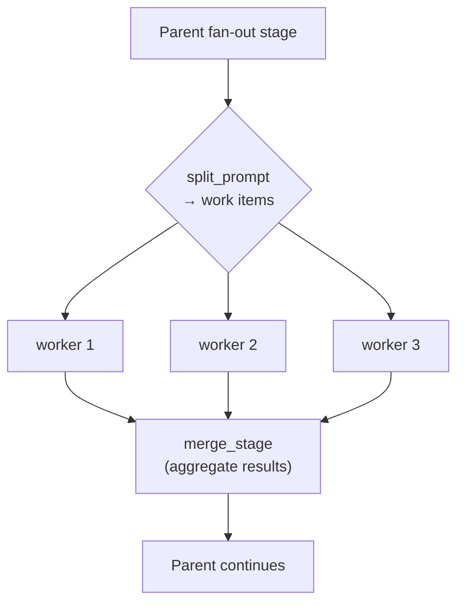
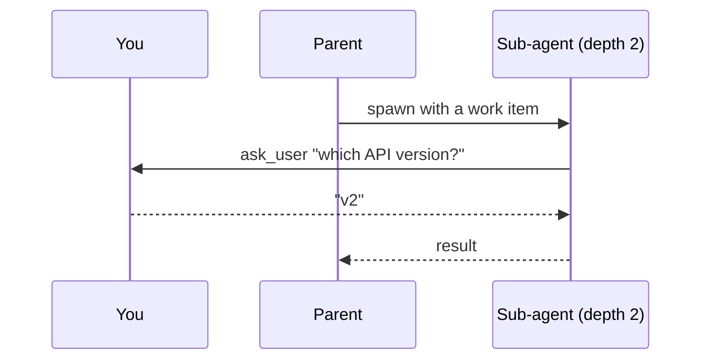

# Sub-agents and fan-out

Some jobs are really many small jobs. Twelve failing tests, forty files to review, eight sub-topics
to research. One agent working through them in sequence is slow, and by item nine its context is
full of items one through eight.

A **sub-agent** is a child agent started by another one. Give each item its own sub-agent and they
run at the same time, each with a clean context, and the parent gets the results back.

> [!NOTE]
> **Before this page:** [Multi-stage workflows](/docs/stages).
> **In one line:** a fan-out stage splits a task into items, runs one sub-agent per item, and merges
> what they produce.

This is how the bundled `data-analyst` agent gathers a broad subject at once, one worker per slice
of it, and how a wide research sweep covers many sub-topics in parallel. See the
[agent catalog](/docs/agent-catalog) for both.

Sub-agents cost very little here. They are more entities in the same [world](/docs/engine), so there
are no extra processes to start and nothing has to be serialized between a parent and its children.

## Fan-out

A fan-out stage splits a task into work items, runs one sub-agent per item (up to `max_workers` at a
time), and merges the results back into the parent:



```toml
[stages.fix]
mode         = "fan_out"
worker_stage = "fix_one"    # which worker to run, see below
split_prompt = "..."        # prompt that produces the JSON array of work items
merge_stage  = "verify"     # stage the parent resumes at once workers finish
max_workers  = 8            # how many run at once, default 4
on_worker_failure = "continue"
```

Those keys sit directly on the stage next to `mode = "fan_out"`, not in a sub-table.

| Key | Default | Meaning |
|---|---|---|
| `worker_agent` | unset | A separate installed blueprint to run as the worker |
| `worker_stage` | unset | A stage in *this* blueprint, which must set `allow_as_worker = true` |
| `worker_query` | unset | A hint matched against installed agent types |
| `merge_stage` | unset | Stage that reconciles worker results before the parent moves on |
| `results_region` | `conversation` | Where the consolidated worker report lands |
| `max_items` | unset | Most work items the split may produce |
| `max_workers` | `4` | How many workers run at once |
| `on_worker_failure` | `"continue"` | `continue` merges what succeeded. `fail_all` fails the whole fan-out if any worker fails |
| `split_prompt` | `""` | Added to the stage's system prompt. Its reply is parsed as the list of work items |

Set exactly one of `worker_agent`, `worker_stage`, or `worker_query`. `lev validate` checks that,
and checks that a named `worker_stage` exists and has opted in with `allow_as_worker`.

## What a worker hands back

A worker contributes whatever it submitted through
[`submit_output`](/docs/outputs). That submission is what the merge stage reads.

A worker that submits nothing falls back to the text of its last message. That text is often empty,
because a worker whose final action was a tool call has no trailing prose. Set `require_output` on
the worker stage when the merge depends on its answer.

```toml
[stages.fix_worker]
mode = "autonomous"
available_tools = ["read_file", "edit_file", "shell", "submit_output"]
allow_as_worker = true
require_output = true
```

A worker that finishes without submitting is nudged and re-run a few times first. It never strands
the fan-out: after that the merge proceeds anyway, and the run records `output_forced`.

## Where the results land, and how they share the space

The merge stage reads one consolidated report holding every worker's answer. That report has to fit
a context region, so each worker gets an equal share of it.

Equal is the important word. Each worker's section is the region's budget divided by the number of
workers, so all of them appear. A section that had to be cut says so, and the worker's own run still
has the whole thing.

```toml
[stages.split]
mode = "fan_out"
worker_stage = "gather_worker"
merge_stage = "build"
results_region = "worker_rows"   # default: conversation
max_items = 12                   # default: however many the split produces
```

Name a `results_region` when the results are bulky. The default is `conversation`, which is also
carrying the message history, so a large report competes with the turns around it. A region of its
own has a budget of its own, and that budget is what the shares divide.

`max_items` caps how many work items the split may produce. This is not `max_workers`, which caps how
many run at the same time:

| | Caps | Why you set it |
|---|---|---|
| `max_workers` | How many run at once | Rate limits, machine load |
| `max_items` | How many exist at all | Cost, and each worker's share of the region |

Split a hundred ways and every worker gets a hundredth of the space. Past some point each section is
too small to be worth reading, and `max_items` is how you stop the split getting there. Without it,
whatever the split produces is what runs.

## `max_workers` is not the knob you might think

Three different settings limit concurrency, and they are easy to confuse. All three apply at once:

| Setting | Bounds | Scope |
|---|---|---|
| `max_workers` | Sub-agents this stage spawns | One fan-out stage |
| `[limits] max_concurrent_inferences` | Model requests in flight | Per model, daemon-wide |
| `[rate_limits.<provider>]` | Requests per minute | Per provider |

So `max_workers = 8` starts eight sub-agents, but if the model pool only allows four requests at
once, four of them wait. That is fine and costs nothing. See
[inference pools](/docs/engine#inference-pools).

## Any sub-agent can ask you a question

A sub-agent at any depth can ask *you* something directly. It does not have to route the question
back up through its parent, and nothing is fire-and-forget:



See [Human-in-the-loop](/docs/interaction) for how the question reaches you and how you answer it.

> [!TIP]
> The [dashboard](/docs/dashboard) and the API's `GET /api/agents/tree` show the whole sub-agent
> tree with token totals per subtree, so you can see where the budget is actually going.
