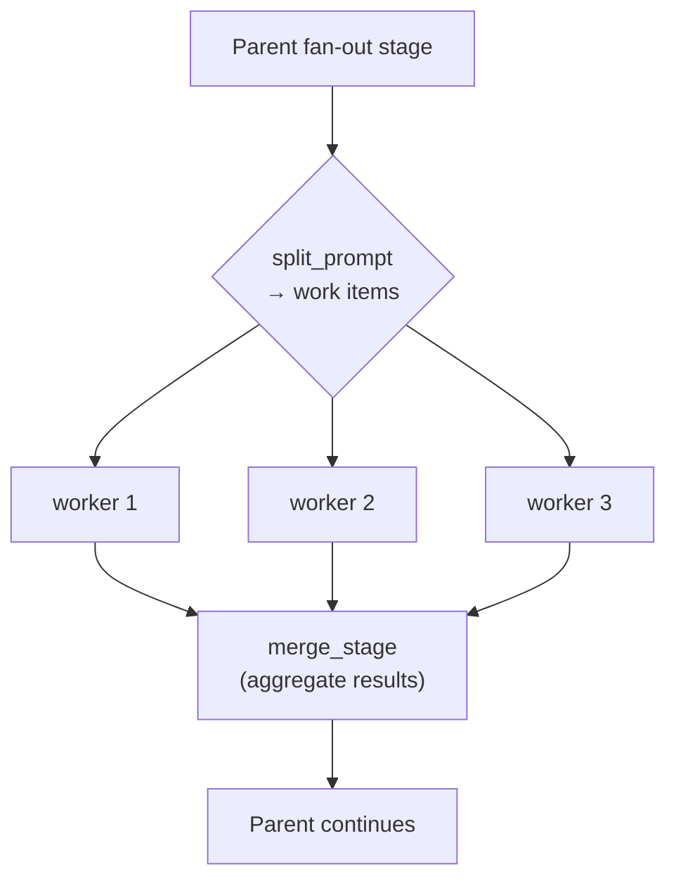
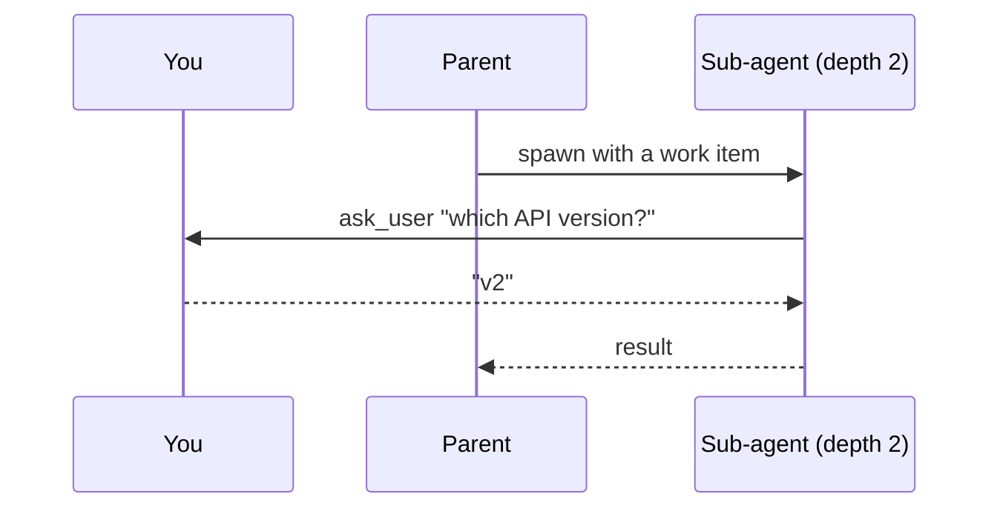

# Sub-agents and fan-out

Agents spawn children with different blueprints, all in the same process and over one shared
inference driver, with no new OS processes and no IPC. Sub-agents are just more entities in the
[ECS world](/docs/engine).

## Fan-out

A **fan-out** stage splits a task into work items and runs one sub-agent worker per item
concurrently, bounded by `max_workers`, then merges their results back into the parent:



```toml
[stages.fix.fan_out]
worker_agent = "."          # blueprint each worker runs
split_prompt = "..."        # prompt that produces the JSON array of work items
merge_stage  = "verify"     # stage the parent resumes at once workers finish
max_workers  = 8            # concurrency bound
on_worker_failure = "continue"
```

This is how the `parallel-fixer` agent fixes many failing tests at once, one worker per failure,
and how a wide research sweep runs many sub-topics in parallel.

## Human-in-the-loop, at any depth

Any sub-agent, at any depth, can ask *you* a question directly, with no fire-and-forget and no
routing through the parent:



> [!TIP]
> The [dashboard](/docs/dashboard) and the API's `GET /api/agents/tree` show the full sub-agent
> tree with per-subtree token roll-ups, so you can see exactly where the budget is going.
