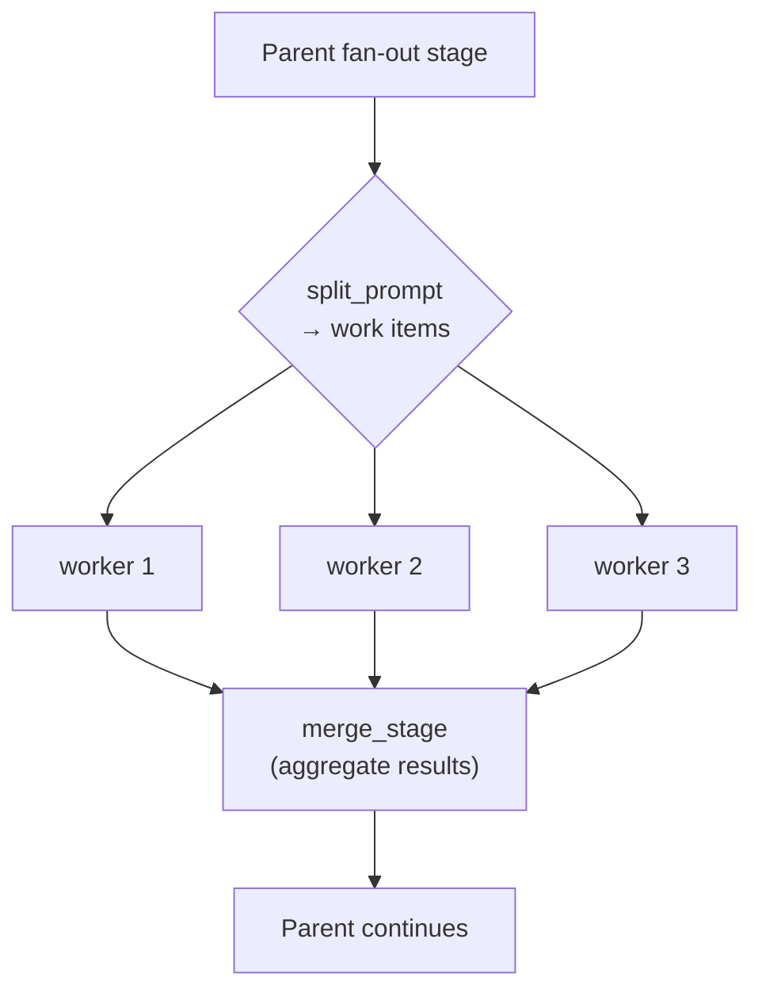
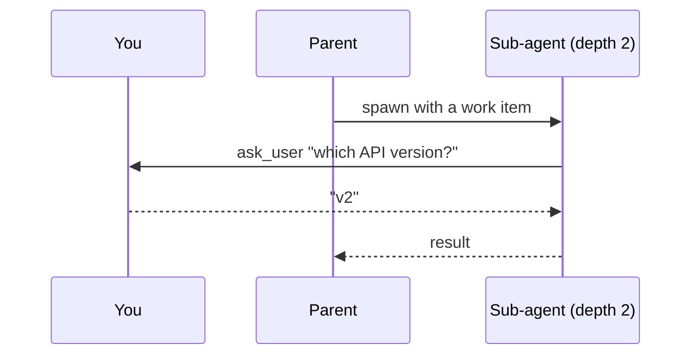

# Sub-agents and fan-out

Agents spawn children with different blueprints, all in the same process and over one shared
inference driver, with no new OS processes and no IPC. Sub-agents are just more entities in the
[ECS world](/docs/engine).

## Fan-out

A **fan-out** stage splits a task into work items and runs one sub-agent worker per item
concurrently, bounded by `max_workers`, then merges their results back into the parent:



```toml
[stages.fix]
mode         = "fan_out"
worker_stage = "fix_one"    # which worker to run, see below
split_prompt = "..."        # prompt that produces the JSON array of work items
merge_stage  = "verify"     # stage the parent resumes at once workers finish
max_workers  = 8            # concurrency bound, default 4
on_worker_failure = "continue"
```

The keys sit directly on the stage alongside `mode = "fan_out"`, not in a sub-table.

| Key | Default | Meaning |
|---|---|---|
| `worker_agent` | unset | A separate installed blueprint run as the worker |
| `worker_stage` | unset | A stage in *this* blueprint, which must set `allow_as_worker = true` |
| `worker_query` | unset | A discovery hint matched against installed agent types |
| `merge_stage` | unset | Stage that reconciles worker results before the parent transitions |
| `max_workers` | `4` | How many workers run at once |
| `on_worker_failure` | `"continue"` | `continue` merges what succeeded; `fail_all` fails the whole fan-out if any worker fails |
| `split_prompt` | `""` | Folded onto the stage's system prompt; its response is parsed as the work-item array |

Exactly one of `worker_agent`, `worker_stage`, or `worker_query` must be set. `lev validate`
checks that, and that a named `worker_stage` exists and has opted in with `allow_as_worker`.

> [!NOTE]
> `max_workers` bounds how many *sub-agents* this stage spawns. It is not the same knob as
> `[limits] max_concurrent_inferences`, which bounds in-flight requests per model across the whole
> daemon, or `[rate_limits.<provider>]`, which shapes request rate. All three apply. See
> [Inference pools](/docs/engine#inference-pools).

This is how the `parallel-fixer` agent fixes many failing tests at once, one worker per failure,
and how a wide research sweep runs many sub-topics in parallel.

## Human-in-the-loop, at any depth

Any sub-agent, at any depth, can ask *you* a question directly, with no fire-and-forget and no
routing through the parent:



> [!TIP]
> The [dashboard](/docs/dashboard) and the API's `GET /api/agents/tree` show the full sub-agent
> tree with per-subtree token roll-ups, so you can see exactly where the budget is going.
