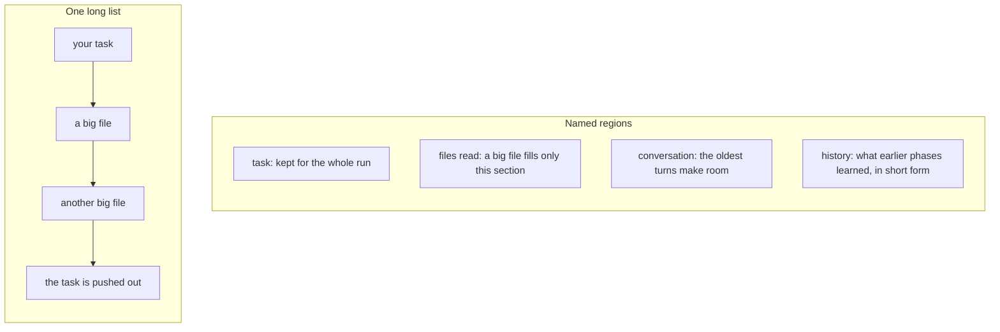

# What is Leviath?

You already run an agent. You have seen what happens on a long job. The model's memory gets full,
the agent makes a short note of its own work, and details you need later are gone. Your best and
highest-priced model ends up doing your cheapest reading. If the process dies, the work goes with
it.

Leviath is a runtime, the program your agents run on, for the other side of that wall. You put the
job in a file as a list of phases. Each phase gets its own model, its own tools, and its own share
of memory. Leviath then runs it on your machine, in the background. Memory is kept in named
sections, so a big file cannot push the task out. Cheap models do the reading and strong models do
the writing. Every step is written to disk, so a crash goes on from where it stopped in place of
starting again. One file describes the agent. One binary runs ten thousand of them.

## I already use an agent. What is the problem?

Some words first. An **agent** is software that does a job in many steps, using a **large language
model**, the AI that reads and writes text. A **tool** is a thing the agent may do other than talk:
read a file, run a command, search the web. Long runs fall apart in the same five places.

### Long runs forget what you told them

An agent's working memory is its **context window**. That is all it has seen and done so far, sent
to the model as one long input. The input is measured in **tokens**, the small bits of text a model
works in. On a long job the window gets full. Most agents then do a **compaction**: the agent makes
a summary of its own work and goes on from the summary. A summary of messy work is still messy. A
rule you gave at the start, or a detail you need an hour later, is gone.

### Reading costs what planning costs

The model that reads ten files is the same one you pay top price for on a hard edit. There is no
natural place to say "use the cheap one here, the good one there".

### A handful of agents fills the machine

Going from one agent to fifty means fifty processes, each with its own memory and its own start
time. The machine is full long before the work is.

### A crash means starting over, or doing it twice

If the machine goes down or the process dies in the middle of a job, the work is gone. So is the
money you paid for it. A tool call that was half done is either lost or run again.

### You can interrupt the agent, but not its sub-agents

You can stop a chat and say "not that way". A worker the agent started for itself, three levels
down, is out of reach. It goes on with the wrong plan until it is done.

## What does Leviath do differently?

Four ideas. Each one is small on its own.

### You describe the agent in a file

A **blueprint** is a file named `agent.leviath`. It lists the phases of the job, which Leviath calls
**stages**: for example research, plan, build, check. There is no agent code to write. A research
stage can use a cheap model with read-only tools. The build stage after it can use a strong model
with write access. The two models can come from two different companies, and Leviath sends each
call to the right place.

```toml
[stages.research]
model = { models = ["gpt-5.4-mini"] }
available_tools = ["read_file", "list_dir"]

[stages.build]
model = { models = ["claude-opus-5"] }
available_tools = ["read_file", "write_file", "shell"]
```

### Memory is in named sections, not one long list

Leviath cuts the context window into **regions**, named sections. Each has its own **budget** and
its own rule for what happens when it is full. A budget is the share of the window a section may
use. The task stays in its section for the whole run. Files the agent reads go in a section of
their own, so a big file fills that section and nothing else. When that section is full, the
oldest reads are folded into a short form, and the file itself is still on disk to read again.
The conversation has a section where the oldest turns make room for new ones.



Think of a set of named boxes in place of one pile. Regions keep the memory in order. They do not
stop the model from making errors. In the runs measured on the [home page](https://leviath.dev),
30 of 30 jobs finished on data too big to fit in the window.

### Agents run in the background

`lev run` hands the job to a background service, the **daemon**, and comes back at once. Close the
terminal and the agent goes on. A waiting agent is stored as data, not as a running process, so
thousands fit in one small program. One 42 MB binary has room for 10,000 or more agents, and a new
run starts in about 64 ms. You watch them with `lev dash` in the terminal, or from
[The Lair](https://leviath.dev/lair), the web console.

```bash
lev run coder --task "Build a CLI that converts CSV to JSON"   # comes back at once
lev dash                                                       # watch every run
```

Before it writes a file or runs a shell command, the agent stops and asks you. It goes ahead on its
own only when you started the run with `--yolo`, which tells it to stop asking. See
[Interaction](/docs/interaction).

A run in the background is not a black box you wait on. `lev msg` sends a message into a running
agent, and the agent reads it between one model call and the next. A sub-agent takes a message the
same way, by its own id, so you can redirect a deep worker without stopping the whole job.

```bash
lev msg <agent-id> "Skip the tests directory, it is generated"
```

### All of it is written down as it happens

Every run keeps a **journal** on disk: its context, its stages, its logs, and its answer, written as
it goes. Stop the daemon in the middle of a run and the next start takes the work back up. A step
that was cut off in the middle is picked up, not run a second time. The files a run makes land in
its **workdir**, the directory you started it from.

## What is it not?

- Not a chatbot, and not a stand-in for the turn-by-turn chat you have with a coding agent. For a
  quick edit, use Claude Code or Codex. Leviath asks you to describe the work up front. That pays
  off on a job with phases and gets in the way of a quick one.
- You bring the model: an API key, a ChatGPT sign-in, or a local model such as Ollama. Leviath is
  the runtime, not the model.
- You run it yourself: one binary on your machine. There is no hosted service, and no way to put
  one job across machines.
- The opt-in sandbox covers shell commands today. File tools are kept inside the workdir by
  a path check. Work to make the sandbox cover more is under way. See [Security](/docs/security).

## Who is it for?

Leviath is a good fit when:

- the job has phases that want different models and tools, and you will run it more than once
- you want many agents running at the same time, on one machine
- you want to say exactly what is in memory at each phase, and what each phase may cost
- you want a person in the loop at the points you choose: a plan to approve, a question to answer,
  a result to check
- you want a run that survives a closed terminal, a crash, or a restart

Leviath is the wrong answer when:

- you want quick edits in a chat, turn by turn
- you want agent logic written in Python or TypeScript (see [Where Leviath sits](/docs/comparison))
- you want another company to run it for you

## What do I do first?

Install is one command:

```bash
curl -fsSL https://leviath.dev/install.sh | sh
```

After it, `lev setup` asks for one model provider, and you are ready.

- [Getting Started](/docs/getting-started): from install to a running agent in four steps.
- [Agent catalog](/docs/agent-catalog): the seven ready-made agents.
- [Build your first agent](/docs/first-agent): write a blueprint from an empty directory.

Then read [Overview](/docs/overview) for the whole system in one pass.
