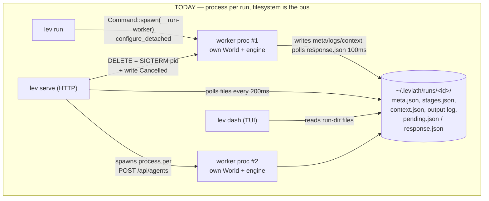
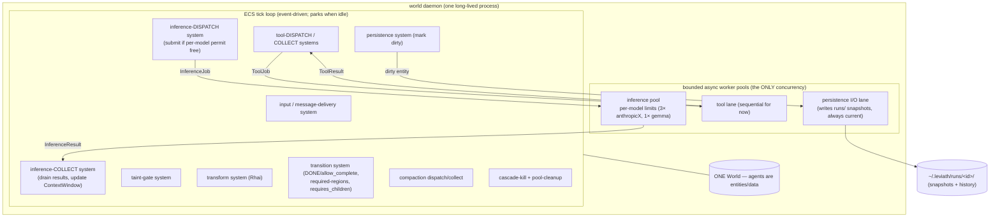
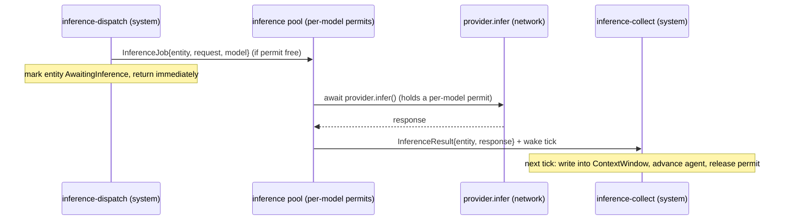
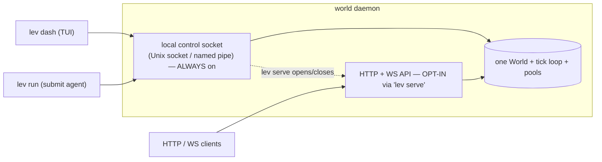

# Consolidating all agents into one shared ECS world

**Status:** investigation + plan (no code changes yet). Revised after design direction: **pure data-oriented ECS game loop**.
**Prerequisite landed:** PR #29 (zero-unsafe + edition 2024) is merged to `main`.
**Scope:** why we're doing this, how it works today, the target design, a no-regression checklist, a phased plan, and the few remaining decisions.

---

## 1. Context & goal

Leviath adopted `bevy_ecs` so that **an agent is data in a World**, processed by a fixed set of systems — like a game engine processing entities. Starting the 11th agent should add one entity, not start an 11th process/thread/task.

**What we found:** that model is *half-built*. It works **within a run** (fan-out sub-agents are entities in one World). But at the **top level**, every `lev run` and `POST /api/agents` spawns a separate `lev __run-worker` **OS process**, each with its **own** World, coordinated through files under `~/.leviath/runs/<id>/` + SIGTERM-to-PID. 10 runs = 10 processes.

**The goal:** one long-lived **world daemon** hosting a **single World**, in which **every** agent (run / API / sub-agent) is **pure data driven entirely by the ECS systems** — a traditional game loop. Expensive async I/O (inference, tools, disk) is offloaded to **bounded worker pools** the systems dispatch to and collect from. Resource usage is bounded by the pools and the system-executor threads, **not by the number of agents**.

### Design principles (from you — these are the spec)

1. **The ECS drives everything. Nothing runs an agent but the systems.** No per-agent task/thread/loop. Agents are as **stateless as possible** — their state is just data in memory/a file that the systems process.
2. **One World** (multiple worlds later ⇒ world-scoped config is a simple global for now).
3. **The only concurrency is bounded worker pools**, with **controls where it matters** — a **per-model inference pool** for sure; **tools sequential for now** (poolable later).
4. **Systems never block on I/O.** They dispatch async jobs to pools and collect results on a later tick. **A single inference can take up to ~1 hour** for very large requests — this is precisely why pooling exists (bound how many parallel requests we make per model) and why the tick must never hold one: an hour-long inference is just an agent parked in `AwaitingInference` for an hour while one per-model permit is held; the tick and every other agent keep running.
4b. **Remove dead code as we go.** Each phase deletes the code it makes obsolete (the imperative loops, process-spawn, filesystem-IPC/polling, SIGTERM cancellation, foreground/background, the `__run-worker` subcommand, …). The end state should be a *significantly smaller* codebase — that simplification is an explicit goal, not a side effect. (Note: this is "code that is now dead," not speculative future features.)
5. **Efficient:** event-driven tick (park when idle); CPU scales with in-flight work, not agent count.
6. **Pause = data not being processed.**
7. **Per-agent state file kept current**, written by a persistence system on an I/O lane so it never stalls the tick; keep the `runs/` layout for back-compat.
8. **Background daemon** that survives terminal close; **TUI/CLI manage it over a local control channel by default; `lev serve` opts the HTTP API in/out.**
9. **Everyone is a thin client** into the daemon. **Remove foreground/background modes.**
10. **No functionality change** — plus **close the pre-existing gaps** and **wire Rhai** onto the live path.

---

## 2. How it works today (verified)

### 2.1 Process-per-run + filesystem-as-IPC

- **`lev run`** self-execs a detached `__run-worker` process per run (`run/mod.rs:232-269`), fire-and-forget; `--foreground` runs inline (`run/foreground.rs:541`).
- **`lev serve`** holds only `{config, broadcast}` (`serve/types.rs:87-91`), spawns a worker **process** per `POST /api/agents` (`serve/agents.rs:173-209`), and observes agents by **polling `~/.leviath/runs/*` every 200ms** (`serve/polling.rs:35-50`).
- **Files are the source of truth + IPC**; interactions poll `response.json` every 100ms (`interaction.rs:136`); cancellation is SIGTERM-to-pid + the server writing `Cancelled` + scanning `parent_run_id` to cascade (`serve/agents.rs:336-367`). **No pause/resume exists.**

### 2.2 What already carries over (good news)

- **Agent state is already per-entity:** `AgentState`, `ContextWindow` (the conversation/memory), `ParentRef`, `SubAgentChildren`, `MessageInbox`, per-entity `taint_gates`. These are the data components a systems pipeline needs.
- **Fan-out already runs many agents in one World** with a shared `EngineHandle` and overlapping inference.
- **The lock-free-inference discipline already exists** (`run_inference_loop_shared`, `engine.rs:172-338` — releases the lock across network/tool awaits). It's an imperative per-agent loop today; its *logic* is what we move into systems.
- **The bevy `Schedule` + 7 systems already exist** (`engine.rs:346-356`, `systems.rs`) but are **test-only scaffolding** — production drives agents imperatively. We flesh these out into the real pipeline. (One behavior — `requires_children` gating — lives *only* in the un-scheduled `stage_gating_system`; must be preserved.)
- **`RunIO` trait** (`leviath-runtime/src/run_io.rs`) is the seam for I/O; a new in-memory impl replaces files with channels.

---

## 3. Target architecture — a traditional ECS game loop

### 3.1 The loop, systems, and worker pools

- **The World holds all agents as entities.** A fixed `Schedule` of systems runs each tick over *all* agents (bevy's `multi_threaded` executor + `par_iter` = "the ECS threads driving all agents"). The set of systems is constant regardless of agent count.
- **Systems are synchronous and fast — they never `.await`.** Expensive async I/O is offloaded:
  - **inference-dispatch** system: for each agent in `ReadyToInfer`, if a **permit for that agent's model** is available, push an `InferenceJob{entity, request, model}` to the inference pool and mark the agent `AwaitingInference`; otherwise leave it `ReadyToInfer` (it's retried next tick — "waiting for a slot" is just data).
  - **inference-collect** system: drain finished `InferenceResult`s from the pool's return channel, write them into the entities' `ContextWindow`s, advance them.
  - same **dispatch/collect** shape for **tools** (sequential lane for now) and **compaction** (uses the inference pool).
- **Worker pools are bounded and sized independently of agent count.** The **inference pool enforces the per-model concurrency limits** (semaphore or per-model lanes). This is world-global (all agents draw from it) and composes with fan-out's `max_workers`.
- **Event-driven tick:** after a pass, if nothing advanced and all agents are waiting on pools/input, the loop **parks** until a worker completion, a new-agent submission, or an interaction answer wakes it. Idle world ≈ 0% CPU.

### 3.2 The sync ECS ↔ async I/O bridge (the crux)

bevy systems can't `.await`; network inference takes seconds. So:

- The **World + Schedule live on the tick control** (a dedicated thread / a synchronously-ticked loop). The **worker pools live on the tokio runtime**. They communicate only via **channels**:
  - dispatch: system → `mpsc<Job>` → pool.
  - collect: pool → `mpsc<Result>` → system (drained each tick).
- A finished job's result is a small message (`{entity_id, payload}`) applied to the entity on the next tick. **No system ever holds a network call.** This is the classic "async work off the game loop" pattern (request → worker → poll for completion).
- Worker completions also **signal the tick to wake** (for the event-driven loop).

### 3.3 Agents are pure data

- No agent owns a task, thread, or loop. An agent is an entity with components (status, context window, pending tool calls, model config, taint gates, parent/children). **All logic is in the systems.** "Pause" = a status the systems skip; "resume" = flip it back. Cancellation = set a `Cancelled` component; the cascade-kill + pool-cleanup systems handle the rest.
- **Consequence — the `spawn_agent`-tool no-driver bug vanishes:** a spawned child is just an entity, driven by the same systems as everything else.

### 3.4 Persistence — snapshots that stay current without stalling the tick

- In-memory components are the live source of truth. A **persistence system** marks changed agents dirty; an **I/O lane** writes each dirty agent's state to its file **off the tick's critical path**, keeping it current. Format: keep the existing `~/.leviath/runs/<id>/` JSON layout (back-compat + existing tooling + history). On daemon restart, agents are **reloaded from these snapshots** (resume or mark interrupted).

### 3.5 Daemon + clients

- **One daemon owns the World + tick loop + pools**, launched detached once (the single remaining use of `configure_detached`), surviving terminal close. **Single-instance** (control-socket lock). **Lifecycle:** auto-start on first client use, plus explicit `lev daemon start/stop/status`.
- **Local control plane (always on):** Unix socket / named pipe for `lev` CLI and `lev dash`. Private by default.
- **HTTP+WS API (opt-in):** the existing axum stack, opened/closed by `lev serve` / `lev serve stop`, now backed by the live World (no file polling).
- **`lev run` and everything else are thin clients.** Foreground/background modes are **removed** — `lev run` submits an agent to the daemon and optionally attaches to stream its output.
- **Per-world log directory** (e.g. `~/.leviath/worlds/<world>/`), anticipating multi-world.

### 3.6 What replaces what

| Today | Target |
|---|---|
| `Command::spawn(__run-worker)` per run/API | `spawn_agent(world)` — one entity; systems drive it |
| imperative `run_inference_loop_*` per agent | the systems pipeline drives all agents |
| root loop holds World lock across inference | systems never block; inference on the bounded pool |
| `~/.leviath/runs/*` as source-of-truth + IPC | in-memory components; files = async snapshots |
| 200ms file polling; 100ms interaction polling | engine emits events; interactions in-memory |
| SIGTERM-to-pid + `Cancelled` file + parent scan | `Cancelled` component + cascade-kill system |
| foreground vs background | one model: submit to the daemon |
| Rhai only reachable from `lev test` | Rhai wired as the Transform system |

---

## 4. No-regression checklist (must work identically)

Most agent state is already per-entity and carries over directly (`ContextWindow`, taint gates, region taint, required-region revisits, sub-agent tree/messaging). Preserve exactly:

- **Tools:** builtin fs/`shell`(60s, child-CWD=workdir)/context/sub-agent tools; MCP stdio servers; **Allow/Ask/Deny** with full precedence (launch→stage→agent→global→default). *(Today enforced in two duplicated paths — collapse to one in the pipeline.)*
- **Fan-out:** split→resolve(agent/stage/query)→drive(`max_workers`)→merge; `Continue`/`FailAll`; message-interruptible workers. In the new model, workers are just more entities; `max_workers` becomes a per-parent gate the dispatch system honors (alongside the global inference pool).
- **Interactions:** ask_user_text/choice/confirm, present_for_review, edit_document, tool-approval (300s→auto-deny), taint-gate prompts; Once/Session scope; static interaction points (directives, followups, abort, in-place edit, `MAX_REVISION_ROUNDS=4`).
- **Context/memory:** 7 region kinds + lifecycle, turn-group integrity, required regions + revisits (cap 3), min-working-budget, carry/compact/clear transforms, compaction, Anthropic cache breakpoints (≤4, system-first).
- **Taint/security:** per-entity gates, `check_traditional`, audit, global→agent→stage cascade. *(Also wire the `lev policy` allowlist, currently inert — see §5.)*
- **Stages/graph:** all stage fields incl. `allow_complete` (DONE), `allow_as_worker`, `requires_children`, `max_revisits`, transitions/conditions/transforms, terminal-path validation.
- **Providers:** Anthropic (caching, dump-dir → make per-agent), OpenAI/Gemini/OpenRouter, Ollama, Claude Code subprocess; data-driven model tiering; per-model capability overrides; per-instance backoff; title generation; the `pool_max_idle_per_host(0)` + 900s read-stall client settings.
- **Run metadata & webhooks:** status lifecycle, token accounting, `callback_url`, tree.

**Per-process couplings to fix while doing this:**
- **`session_allows` / stage-permission singletons** are per-*run* `Arc<Mutex>` today — **move onto the agent entity** or they leak across agents in one process.
- **Env/credentials + `dotenvy::dotenv()`** read/mutate process env — load world config **once** at daemon start; make `LEVIATH_DUMP_REQUEST_DIR` per-agent.
- **Working directory is already safe** (tools take `workdir` as data; production never `set_current_dir`) — just key the tool file-lock map by absolute path so distinct workdirs don't collide.

---

## 5. Latent code — now given a job (per your direction)

- **ECS `Schedule` + systems:** currently test-only scaffolding → **become the real driver** (the whole point). Flesh out `inference_system` etc. into the dispatch/collect pipeline; keep `requires_children` gating (`stage_gating_system`).
- **Rhai scripting engine:** currently only `lev test` → **wired as the Transform system** (stage transforms run Rhai, parallel across agents via `par_iter`/compute pool). Also becomes available to the taint gate's `ScriptRuleChecker` (currently passed `None`).
- **`TaskScheduler`:** evaluate whether the tick loop subsumes it; likely delete.
- **Close the pre-existing gaps** (per your direction): `spawn_agent`-tool children now driven for free; wire the `lev policy` taint allowlist onto the live path (currently `PolicyConfig::default()`); implement `lev respond`.

---

## 6. Phased plan

Each phase is its own PR(s), verifiable against today's behavior, and **deletes the code it obsoletes** (see §7b) so the tree shrinks as we go and the hard-100% coverage gate stays green.

1. **Pools + bridge infrastructure.** Build the inference pool (per-model permit map from config, unbounded FIFO), the sequential tool lane, the persistence I/O lane, and the `mpsc` dispatch/collect channels + component markers (`ReadyToInfer`/`AwaitingInference`/result inboxes). Built alongside the existing loop; no behavior change yet.
2. **Flesh out the systems into the real pipeline (multithreaded from the start).** Port each step of the imperative loops into systems — inference dispatch/collect, taint-gate, tool dispatch/collect, transform (Rhai), transitions (DONE/allow_complete/required-regions/requires_children), compaction, cascade-kill, pool-cleanup, persistence — with bevy `multi_threaded` + `par_iter` on from day one. **Delete the two imperative loops.** Validate single-agent parity (identical conversation/outputs vs today) first, then many agents in one World.
3. **Event-driven tick loop** (hand-rolled) driving the schedule; park-when-idle (no busy-spin); crash isolation (a panic in a per-entity step marks that agent `Error`, never crashes the tick).
4. **World daemon.** One World + tick loop in a long-lived process; local control socket; single-instance; lifecycle (auto-start + `start/stop/status`); per-world log dirs; restart recovery from snapshots.
5. **Thin clients + delete the old shell.** `lev run` + `lev dash` → daemon over the control socket; **remove foreground/background**, the `__run-worker` self-exec + process-spawn, the 200ms/100ms file polling, and the SIGTERM path; `lev serve` becomes the HTTP toggle on the daemon.
6. **Finish gaps + final cleanup.** Rhai transform system live; `lev policy` allowlist wired; `lev respond` implemented; sweep any remaining dead code from §7b; confirm the full no-regression checklist + hard-100% coverage.

---

## 7. Decisions — all settled

- **Architecture:** pure ECS pipeline (Option B); systems drive all agents; per-model inference pool; tools sequential for now; concurrency-only limits; always-current snapshots in the `runs/` layout; Rhai as a Transform system; gaps closed; thin clients only, no foreground/background; auto-start daemon + `start/stop/status` + per-world logs.
- **Inference pool backpressure:** **unbounded FIFO** to start (saturated ⇒ agents stay `ReadyToInfer`, retried each tick). Round-robin-per-model fairness can be added later if a model's backlog ever starves others.
- **Parallel systems:** **on from the start** — enable bevy `multi_threaded` + `par_iter` from day one; the multithreading perf win is too large to defer. (Design constraint this imposes: all system params and the pool channels must be `Send`; systems that touch the same components get ordered/disjoint access — standard bevy scheduling.)
- **Tick loop:** **hand-rolled** minimal event-driven loop (simplest, full control over park/wake). Watch for perf pitfalls — mainly avoid busy-spinning (park on a condvar/notify when no work) and avoid per-tick allocations in the hot path.
- **Fan-out `max_workers` vs the inference pool:** **keep both.** They're different things — `max_workers` is a blueprint-level sub-agent fan-width control; the pools are under-the-hood per-model request limits.

Nothing is blocking. Next step is turning this into concrete implementation tickets, phase by phase (Phase 1 = pools + the sync/async bridge).

---

## 7b. Deletion inventory (the "simpler codebase" payoff)

Code that becomes **dead as a direct result** of this change and should be removed in the phase that obsoletes it (tracked so the simplification is deliberate, and so the hard-100% coverage gate stays green as coverage burden drops):

- **The two imperative run loops** — `run_inference_loop_shared` (`engine.rs:172-338`) and `run_inference_loop_filtered*`/`run_stage_loop` (`engine.rs:1176-1475`, `executor.rs`) — replaced by the systems pipeline.
- **Process-spawn machinery** — the `__run-worker` subcommand and `execute_worker`/`run_worker_inner` (`run/worker.rs`), the `Command::spawn(__run-worker)` blocks in `run/mod.rs` and `serve/agents.rs`, and every `configure_detached` caller **except** the daemon launcher (its one remaining use).
- **Foreground/background split** — `run/foreground.rs` (`run_foreground*`, `ForegroundIo`, `ConsoleIO` stdin path) and the `--foreground`/`--count`/background branching in `run/mod.rs`.
- **Filesystem-as-IPC** — the 200ms polling loop (`serve/polling.rs`), the run-dir *source-of-truth* writes/reads (`runstate.rs` keeps only the async **snapshot** writer + restart loader), the `parent_run_id`-scan tree builder (`serve/tree.rs` → read the live World), and `RUN_ID_COUNTER`/process-global run-dir plumbing that's no longer needed.
- **Interaction file-polling** — `pending.json`/`response.json` + the 100ms `poll_step` loop (`interaction.rs`) → in-memory channels.
- **SIGTERM cancellation path** — pid-based `kill_agent` + cascade scan (`serve/agents.rs:336-367`) → `Cancelled` component + cascade-kill system.
- **Duplicated policy/interaction implementations** — the parallel foreground-vs-worker copies of tool-policy enforcement and interaction dispatch collapse into one pipeline path.
- **`TaskScheduler`** (`scheduler.rs`) if the tick loop subsumes it (likely).
- Any run-dir env plumbing / dead helpers left stranded once files are snapshot-only.

Each phase's PR should call out exactly what it deletes; the net should be a materially smaller runtime + CLI.

---

## 8. Risks & mitigations

- **Blocking the tick on I/O** → the entire design forbids it: systems only dispatch/collect; all `.await` lives in the pools. This is the invariant to guard in review.
- **One agent's bad data crashing a whole system pass** → per-entity `catch_unwind`/validate-then-process so a single agent faults to `Error` without taking down the tick.
- **A hung provider** → isolated by the bounded pool + the 900s read-stall backstop + per-request timeouts; other agents keep ticking.
- **Hour-long inferences vs. the 900s read-stall timeout** → the existing `READ_STALL_TIMEOUT_SECS=900` is a *per-read* (gap-between-bytes) timeout, so a long **streaming** response that keeps emitting chunks is fine for an hour. But a long **non-streaming** request that sends no intermediate bytes for >15 min would trip it. To support up-to-an-hour requests we must ensure those paths stream (or lengthen/disable the read timeout on them). Flagging to verify per provider during Phase 1 — the concurrency pool assumes a permit may legitimately be held for a very long time.
- **Persistence stalling the tick** → writes are on the I/O lane, never in a system's critical path.
- **Behavior drift during the rewrite** → Phase 2 validates single-agent parity before scaling; the full test suite + hard-100% coverage gate guard every phase.
- **Duplicated foreground/worker policy+interaction paths** → collapsed into one pipeline, removing a standing "keep them identical" hazard.
